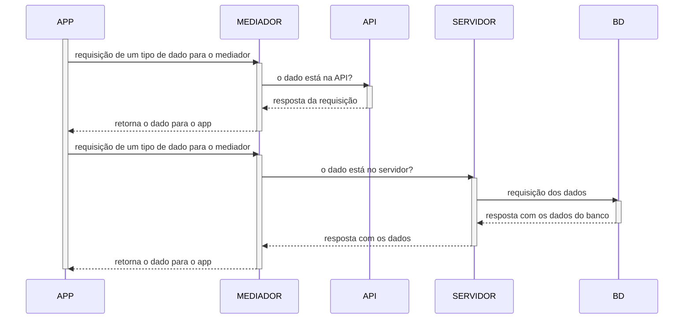

# Modelagem

A princípio o sistema pode parecer difícil, complexo e cheio de nuances. A modelagem do sistema tenta atenuar isso. Nela, utilizamos técnicas visuais como o **Diagrama de Classes** para representar como possivelmente será a estrutura do nosso sistema.

## O App do DCC

Apesar de ainda não começarmos de fato com a sprint, já temos ciência de alguns pontos que foram acordados nos requisitos, usando como base nosso backlog, assim, utilizando desse conhecimento podemos definir uma estrutura base para o aplicativo.

### A estrutura do app

### O Mediator

Como podemos ver, a estrutura do sistema acima utiliza uma técnica de padrão de projeto chamada [Mediator](https://refactoring.guru/pt-br/design-patterns/mediator), pois como teremos dados providos da API e do SERVIDOR, precisamos ter uma classe que centraliza essas informações, isto é, que consegue realizar as requisições para o ponto de acesso correto sem que o APP precise ter isso armazenado.
