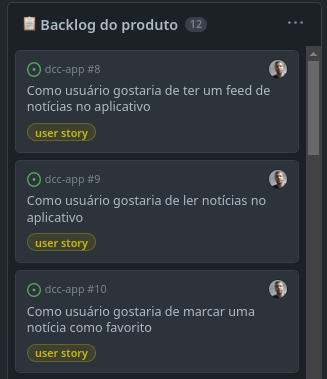
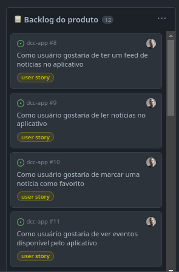
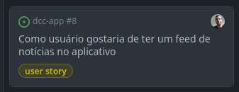

# Requisitos

    O que o software que está sendo desenvolvido deve fazer?

O primeiro passo para o desenvolvimento do software é ter uma ideia do que poderia ser respondido nessa pergunta, assim iniciamos com a análise de requisitos.

**Requisitos** definem o que um sistema deve fazer sob quais restrições. Eles se relacionam com o que "deve fazer" chamados de *requisitos funcionais* e "sob quais restrições fazer" chamado de *requisitos não funcionais*.

## O que o software que está sendo desenvolvido deve fazer?

Responder essa pergunta pode ser díficil em primeiro momento, pois saber ao certo todos os requisitos que um sistema deve ter é um processo complicado e que em geral não há de imediato uma definição, assim, essa análise deve ser feita durante todo o ciclo de desenvolvimento, garantindo que o sistema tenha consistência.

### DCC App

O aplicativo a ser desenvolvido tem como cerne da sua concepção um espaço onde os alunos consigam acompanhar as principais informações do Departamento de Ciência da Computação ao longo da sua graduação, isto é, acompanhar as notícias e atualizações do departamento, acompanhar o andamento de eventos interno ou de parceria com a unidade, se situar a cerca de dúvidas previamente já computadas, uma espécie de FAQs, saber quais oportunidades de iniciação científica com bolsas e voluntárias tem disponível e etc.

## As histórias de usuário

Para iniciar o desenvolvimento dos requisitos, fomos capazes de pontuar o que o aplicativo poderia ter, assim podemos desenvolver as histórias de usuário.

**Histórias de usuários** consiste em uma prática utilizada pelos métodos ágeis para catalogar de forma clara e objetiva juntamente com os clientes, quais funcionalidades esperariam ter no sistema.

As histórias devem respeitar algumas características: 

* ser *independentes*
* aberta a negociações
* agregar valor ao produto
* serem objetivas
* ser testável

A *independência* de uma história do usuário, pode ser levada ao pé da letra ou a um contexto em meio as sprints. Durante a fase de desenvolvimento pode ser complicado que algumas não criem dependências, pois uní-las, pode acarretar em um história extremamente densa, o que não é uma boa prática, sendo assim em alguns casos como o do desenvolvimento do aplicativo por exemplo, unir essas três histórias em uma, ocasionaria uma avaliação de story points maior do que o ideal, com isso quebrá-las em três nesse caso parece ser mais vantajoso.

Nesse caso, poderiamos ter criado uma história:

    Como usuário gostaria de ter uma aba de notícias no aplicativo

Porém, note que nesse caso, só que para termos de implementação a complexidade dessa história poderia ser alta ao adicionar diversos fatores que uma aba de notícias tem: feed de notícias, conseguir ler as notícias, compartilhar, marcar como favorito, salvar para ler depois, etc. Sendo assim, quebrá-las em histórias menores objetiva ainda mais o trabalho e facilita os testes que agora serão isolados para cada especificidade.

### O backlog do produto

O backlog do produto é um espaço onde há uma diversidade de histórias de usuário

Assim, para o App do DCC implementamos via Github Projetct o *backlog do produto*, esse backlog é um método para qualificar quais funcionalidades os usuários gostariam que fossem presentes no sistema, assim, ao longo do desenvolvimentos utilizamos esse "banco" para planejar as sprints.

Para o aplicativo em si, podemos ver o [backlog](https://github.com/users/userhv/projects/1/views/1)  composto por histórias de usuário propostas para que possivelmente possam a ser funcionalidades do aplicativo em questão.

## Casos de Uso

As histórias de usuários como já citadas anteriormente devem ser objetivas ao que se propõe, entretanto é necessário uma maior granularidade para entender qual será o fluxo dentro do sistema, com isso temos os chamados **Casos de Uso**.

O **Caso de Uso** são documentos textuais de especificação de requisitos. Eles incluem uma descrição mais detalhada de qual será o fluxo de execução daquela história no sistema.

Para essa história temos o seguinte caso de uso

    Feed de notícias

    Ator: Aluno

    Fluxo normal

    1. Acessa o aplicativo
    2. Acessa a aba de notícias
    3. Desliza a tela para visualizar os cards com as notícias

Assim, conseguimos traçar qual será o fluxo de execução ao ser impplementada essa funcionalidade no sistema, com isso podemos previamente estruturar como será a lógica para implementar tal feature.

## Tecnologias

Dependendo do andamento do projeto, nessa fase também podemos definir quais tecnologias serão usadas já que temos conhecimento de quais funcionalidades temos no sistema. Sendo assim, para o desenvolvimento utilizaremos.

* [react-native](https://reactnative.dev/)
* [realm](https://realm.io/)
* [firebase](https://firebase.google.com/?hl=pt-br)

### Resumo

Com isso, temos o primeiro passo para a construção do sistema, satisfazendo a nossa pergunta no início dessa seção, na próxima sessão iniciaremos a concepção da estrutura do sistema utilizando o conhecimento prévio sobre quais funcionalidades estarão presentes.