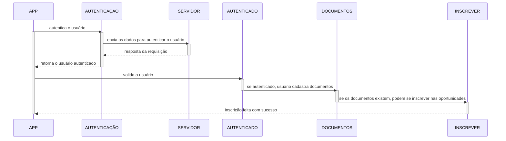

# Sprint 4

O backlog dessa sprint:

* [O backlog da sprint 3](https://github.com/users/userhv/projects/6)

## Menu Oportunidades

Nessa sprint desenvolvemos a principal funcionalidade até o momento do aplicativo, o menu Oportunidades. A ideia dessa feature é que o interessado possa se inscrever em qualquer oportunidade disponível no DCC pelo aplicativo. Para isso, ele deve se autenticar com sua conta do DCC/UFMG e anexar historico escolar e currículo na aba documentos, logo ele estará apto a realizar a inscrição em qualquer oportunidade do departamento sem a necessidade de sempre preencher um mesmo formulário.

A modelagem pensada para essa funcionalidade pode ser apresentada abaixo.

