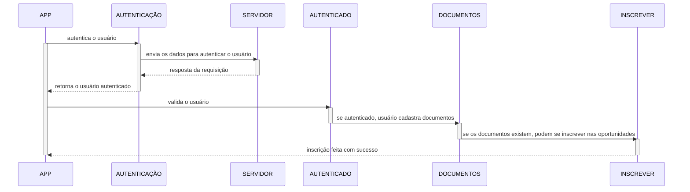
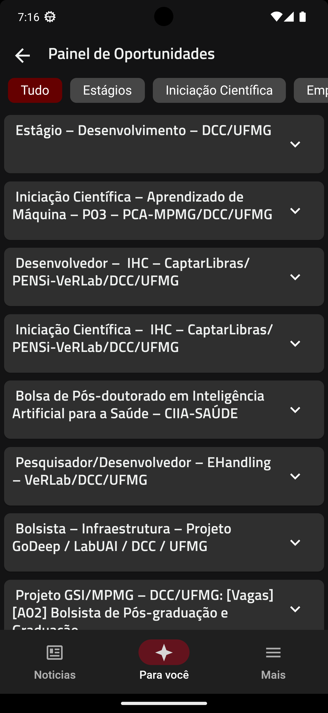
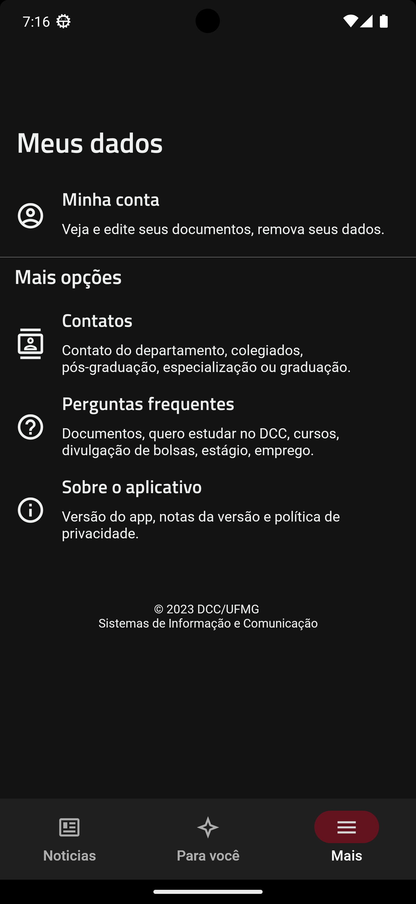

# Sprint 4

O backlog dessa sprint:

* [O backlog da sprint 3](https://github.com/users/userhv/projects/6)

## Menu Oportunidades

Nessa sprint desenvolvemos a principal funcionalidade até o momento do aplicativo, o menu Oportunidades. A ideia dessa feature é que o interessado possa se inscrever em qualquer oportunidade disponível no DCC pelo aplicativo. Para isso, ele deve se autenticar com sua conta do DCC/UFMG e anexar historico escolar e currículo na aba documentos, logo ele estará apto a realizar a inscrição em qualquer oportunidade do departamento sem a necessidade de sempre preencher um mesmo formulário.

A modelagem pensada para essa funcionalidade pode ser apresentada abaixo.

Com isso, temos a implementação do servidor de autenticação que é usado pra validar  o perfil de quem está se cadastrando na oportunidade. Em complementar a isso, estamos utilizando o [firebase](https://firebase.google.com/?hl=pt-br) como um banco para gerenciar os documentos anexados pelos alunos para as inscrições.

Abaixo temos algumas imagens da nova tela de oportunidades

| Oportunidades                            | Conta                                    |
| ---------------------------------------- | ---------------------------------------- |
|  |                  |

## Ajustes de design e mudança de nome

Por fim, fizemos diversos ajustes de design, seja com alteração de iconografia e reordanação da abas do aplicativo visando uma melhor experiência. Também alteramos o nome da aplicação que agora chama DCC App ao invés de DCC News, já que com a evolução do projeto novas funcionalidades foram emabarcadas alterando a funcionalidade principal que antes era somente o fedd de notícias.